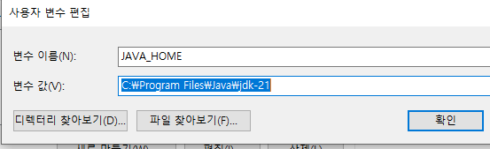
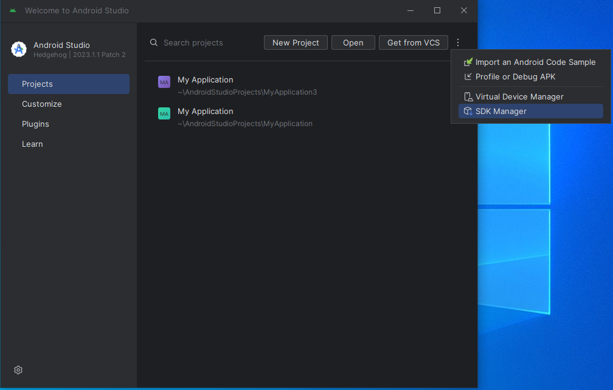
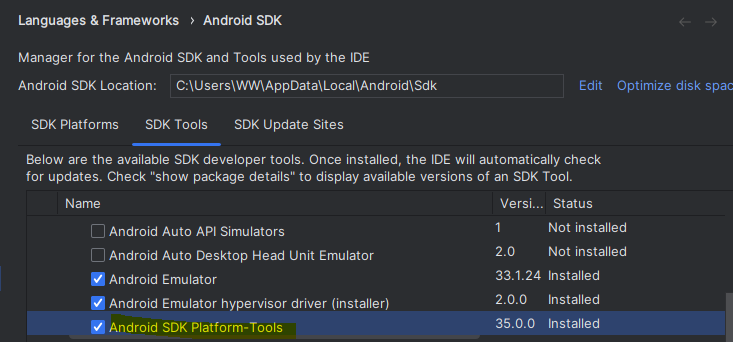
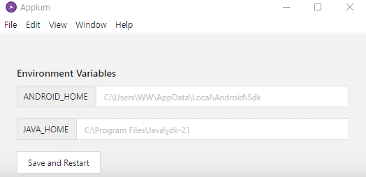
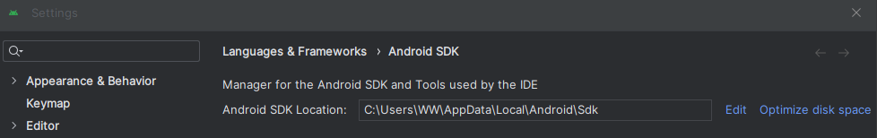
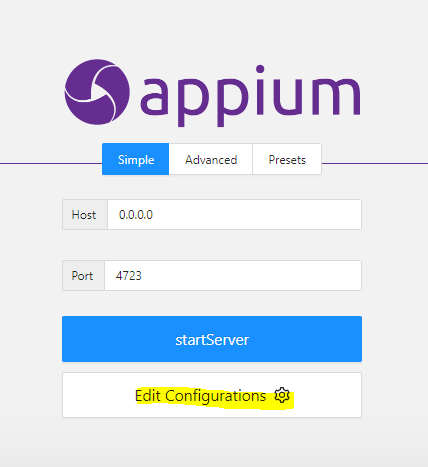
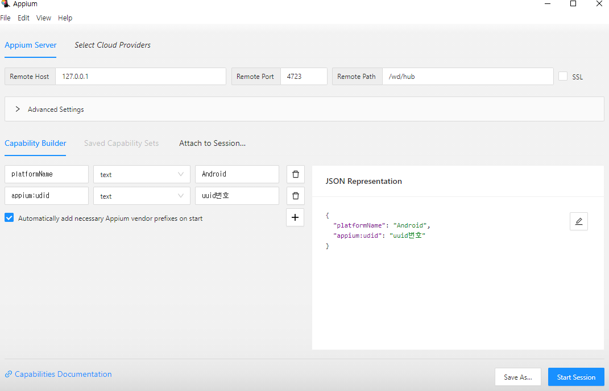
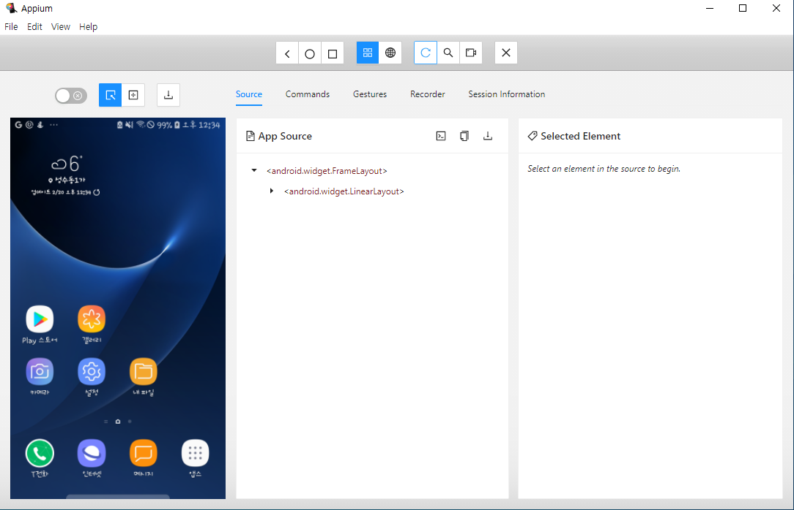

## Appium 설치 가이드
1. JDK 설치 
https://www.oracle.com/java/technologies/downloads/

2. 환경 변수 설정
    > 시스템 > 고급 시스템 설정 > 환경 변수 > 새로 만들기
    
    *사용자 변수 편집

    > JAVA_HOME   
    > C:\Program Files\Java\jdk-21
    
    

    *자바 설치 체크

        > cmd > java -version

3. Android Studio 설치
    - [Android Studio Download](https://developer.android.com/studio?hl=ko)   
    - SDK Manager 경로 참조
        > Tools > SDK Manager
           
    - Android SDK Platform-tools 설치 확인 (없으면 설치)   
    

    - ANDROID_HOME 경로 설정 & JAVA_HOME 경로 설정   
    

    - ANDROID_HOME : 안드로이드 SDK 경로   
    
    - 필요한 Andorid os 별 api 설치   
    - ADB 체크   
        > cmd창에서   
        > adb --version
        
4. Appium 설치
    - [Appium Server GUI 설치](https://github.com/appium/appium-desktop/releases)   
    - [Appium inspector 설치](https://github.com/appium/appium-inspector/releases)
   
    - Appium Server GUI 실행 > Edit Configurations 선택 > 설정
    - 

5. Python Client 설치
    > pip install Appium-Python-Client
    
6. 사용할 단말기 usb 연결
    > cmd창에   
    > adb devices
7. Appium에서 단말 실행법
    1. Appium Server GUI 실행 > startServer 클릭
    2. Appium Inspector 실행 > JSON Repersentaiton에 입력    

        *Remote Path 추가

        > /wd/hub
        *appium:udid 추가 (필수)
        
        
8. Appium에서 Emulator 실행법
    1. AndrodiStudio에서 Emulator 설치
    2. Appium Server GUI 실행 > startServer 클릭
    3. AndrodiStudio에서 Emulator 실행
    4. adb devices 를 cmd창에 입력하여 device 정보 알아내기
    5. JSON Repersentaiton에 입력
        > "appium:deviceName": "device정보"
### 필수 설치
- 안드로이드 스튜디오
- Appium Inspector
- Appium Server
- Python

### 참조) JSON Repersentaiton
```
"platformName" : "Android"
"appium:appPackage":"앱 패키지명"
"appium:appActivity":"앱 메인활동명"
"appium:deviceName": "디바이스 종류"
```

### 참조) JSON 값 
- AppPackage & AppActivity 값 확인
    > 1.cmd 창 입력   
    > adb shell dumpsys window | find "mCurrentFocus"
    
    > 2.결과    
    > mCurrentFocus=Window{xxxxx u0 AppPackage/AppActivity}

### 참조 링크
- [appium server GUI & Inspector 설치](https://ddbobd.tistory.com/entry/windows-AppiumServerGUI-Inspector-install)
- [UI-테스트 자동화 : appium으로 가상 디바이스 실행하기](https://velog.io/@soyean/UI-%ED%85%8C%EC%8A%A4%ED%8A%B8-%EC%9E%90%EB%8F%99%ED%99%94-Appium%EC%9C%BC%EB%A1%9C-%EA%B0%80%EC%83%81-%EB%94%94%EB%B0%94%EC%9D%B4%EC%8A%A4-%EC%8B%A4%ED%96%89%ED%95%98%EA%B8%B0)
- [Appium capabilities](https://appium.io/docs/en/2.0/guides/caps/)
- [wifi 무선 연결](https://iteastory.com/190) 
