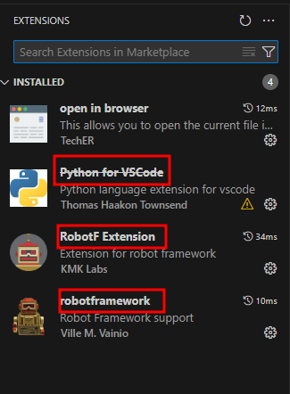

### 파이썬 버전 확인
> $ python --version

### Robot Framework 설치
> $ pip install robotframework
>
> $ pip install robotframework-selenium2library

### 동작 확인
> $ rebot --version
>
> $ robot --version

### 파이썬 확장자
> Python for VSCode
>
> RobotF Extension
>
> robotframework



### ride 설치
> $ pip install robotframework-ride
>
> $ pip install -U https://github.com/robotframework/RIDE/archive/master.zip
>
> $ python -m robotide.init

### Webdriver 설치
> https://chromedriver.chromium.org/downloads

### Hello world
```
*** Settings ***
Documentation     Example using the space separated plain text format.
Library           OperatingSystem
*** Variables ***
${MESSAGE}        Hello, world!
*** Test Cases ***
My Test
    [Documentation]    Example test
    Log    ${MESSAGE}
    My Keyword    /tmp
Another Test
    Should Be Equal    ${MESSAGE}    Hello, world!
*** Keywords ***
My Keyword
    [Arguments]    ${path}
    Directory Should Exist    ${path}
```

### 실행 방법
> robot 파일이름.robot

### 참조 
https://velog.io/@starmom/Robot-Frameworks-1-1-Setup