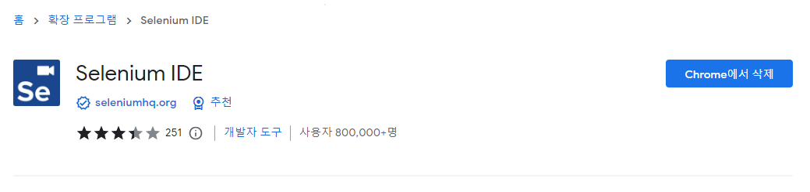
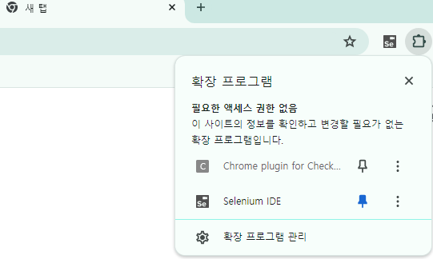
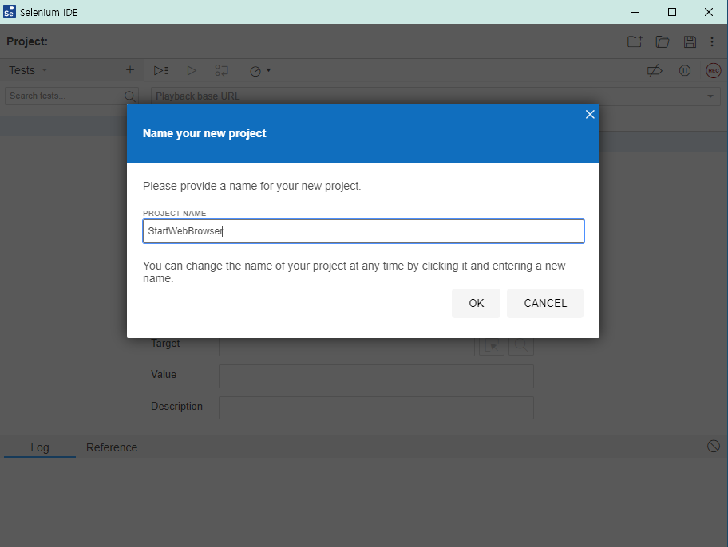
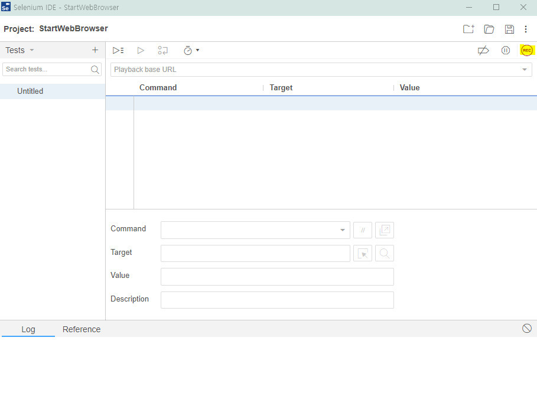
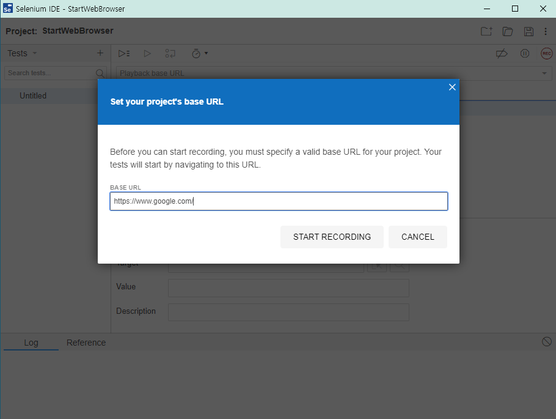
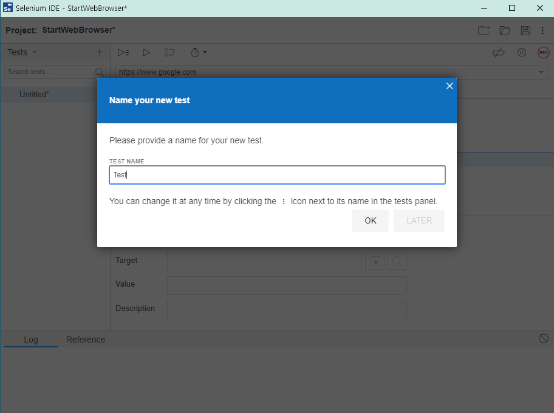
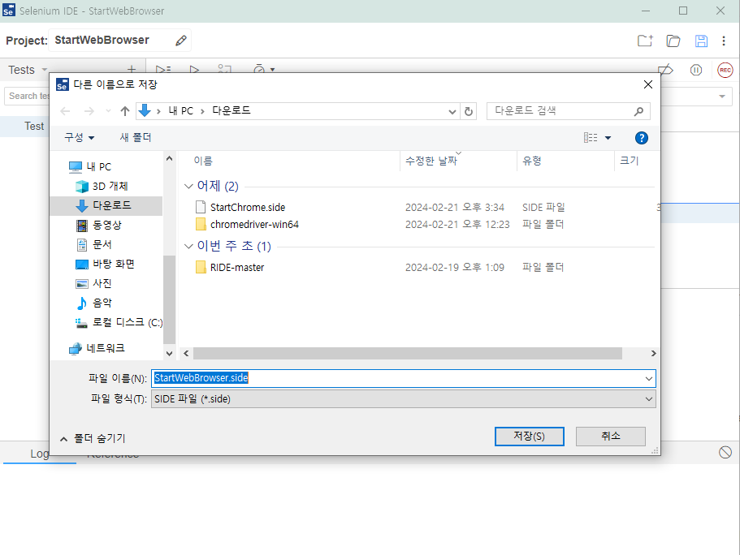

## Selenium Grid 설치 및 실행 가이드

1. 필수 환경 설치
    - Java JDK 설치 

        - [Java JDK Download](https://www.oracle.com/kr/java/technologies/downloads/)   
        - [Java 환경변수 설정](https://coding-factory.tistory.com/838)
 
2. Selenium-server jar 파일 다운 : Selenium Server(Grid)
   
    - [Selenium-server jar site](https://www.selenium.dev/downloads/)

    - jar 파일 경로는 원하는 경로에 둔다. (테스트 할려면 c드라이브 경로 추천)

3. Node js 설치   
    - [NodeJs download](https://nodejs.org/en/download/current)
4. selenium-side-runner 설치 (hub로 테스트를 전송하기 위해)
    ```
    npm install -g selenium-side-runner
    ```

5. 브라우저 드라이버 설치 : 크롬,엣지 등

    - [브라우저 드라이버](https://www.selenium.dev/documentation/webdriver/troubleshooting/errors/driver_location/#use-the-path-environment-variable)

6. 실행 (cmd창에서/cmd창의 경로는 jar파일 경로에서)
    
    *cmd창으로 jar파일 있는 경로로 가기
    ``` 
    cd..
    ```

    6.1 독립적인 실행 (Hub,Node 둘다 포함)

    > java -jar selenium-server-버전.jar standalone  

    예시)
    ```   
    java -jar selenium-server-4.17.0.jar standalone
    ```

    6.2 hub만 실행
    
    > java -jar selenium-server-버전.jar hub

    예시)
    ``` 
    java -jar selenium-server-4.17.0.jar hub
    ```

7. 허브가 실행되는지 주소를 복사하여 웹 브라우저에서 실행

8. cmd창에서 ipconfig로 주소 확인
    ```
    ipconfig
    ```
9. 웹 브라우저 실행 확인 후 노드로 쓸 컴퓨터에 환경 세팅 구축

10. 노드용 컴퓨터에 허브용 주소를 웹브라우저에 실행하여 정상 동작하는지 확인

11. 노드용 컴퓨터의 cmd창에 아래 처럼 치기   
    (주소:포트번호는 허브용주소/cmd창의 경로는 jar파일 경로에서)

    예시)
    ```
    java -jar selenium-server-버전.jar node --hub http://주소:포트번호/grid/register 
    ```

### 실습 : Node에서 Selenium side파일 실행
1. cmd 창에서 허브 실행
    ```
    java -jar selenium-server-4.17.0.jar hub
    ```
2. Hub용 웹브라우저에서 SeleniumGrid 실행 확인
    ```
    http://주소:기본 포트/grid
    ```
    

3. cmd 창에서 ipconfig 로 주소 확인 (IPv4주소)
    ```
    ipconfig
    ```
4. Node용 컴퓨터의 웹브라우저에서 SeleniumGrid 실행 확인
    

5. Node용 컴퓨터의 cmd 창에서 Node 실행
    ```
    java -jar selenium-server-4.17.0.jar node --hub http://주소:포트/grid/register
    ```
6. Hub용 컴퓨터의 cmd 창에서 .side 파일 실행 (StartChrome.side 는 파일 명)
    ```
    selenium-side-runner --server http://주소:포트/wd/hub -c "browserName=chrome" StartChrome.side
    ```
    *실행 이미지 (실행하는 동안 UI보여주었다가 사라짐)
    

7. 테스트 통과/실패 확인
    

### side 파일 생성법 (Hub 및 Node에서 테스트)
1. SeleniumIDE 설치 (Chrome 웹브라우저 기준)   
       
    [SeleniumIDE 설치 경로](https://chromewebstore.google.com/detail/selenium-ide/mooikfkahbdckldjjndioackbalphokd)

2. SeleniumIDE 확장 프로그램 설정   
    
    
4. SeleniumIDE 실행   
    
    
3. 테스트 프로젝트 생성   
    Create a new project 버튼 클릭 > 프로젝트 이름 쓰고 > OK 버튼 클릭
    

4. 테스트 실행   
    Record 버튼 클릭 또는 Ctrl+U 단축키 사용
    

5. 사용할 url 주소 쓰고 테스트 시작하기    
    웹사이트 입력 > start recording 버튼 클릭
    

6. 원하는 테스트를 생성   
    예시) 웹사이트 이동 > 검색창에 python 키워드 입력 > Record 중지 버튼 클릭 > 테스트 이름 입력 > ok 버튼 클릭
    

7. 저장하여 side 파일 생성
    

### 참조

- 노드 생성
    ```
    java -jar selenium-server-4.17.0.jar node
    ```
- 노드 포트 지정
    ```
    java -jar selenium-server-4.17.0.jar node --port 5555
    ```
- 크롬드라이브 경로
    ```
    C:\Users\ww\Downloads\chromedriver-win64\chromedriver-win64\
    ```

### 참조 링크)   
- [selenium grid 공식 문서](https://www.selenium.dev/documentation/grid/getting_started/)   
- [selenium grid hub,node 설치](https://www.whatap.io/ko/blog/39/)
- [chrome에서 selenium IDE 설치 및 실행](https://crazykim2.tistory.com/382)   
- [side 파일 자료](https://github.com/SeleniumHQ/selenium-ide/blob/trunk/tests/examples/echo.side)   

### 키워드
SeleniumGrid, SeleniumIDE, Chrome
